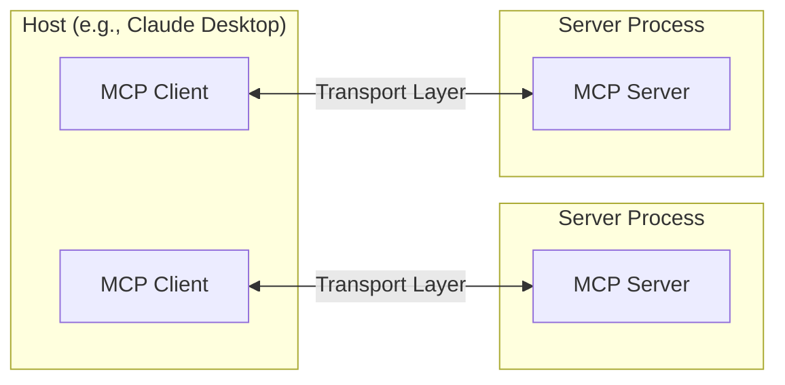

The Model Context Protocol (MCP) is built on a flexible, extensible architecture that enables seamless communication between LLM applications and integrations. This document covers the core architectural components and concepts.

## Overview

MCP follows a client-server architecture where:

- **Hosts** are LLM applications (like Claude Desktop or IDEs) that initiate connections
- **Clients** maintain 1:1 connections with servers, inside the host application
- **Servers** provide context, tools, and prompts to clients



## Core components

### Protocol layer

The protocol layer handles message framing, request/response linking, and high-level communication patterns.

<Tabs>
  <Tab title="TypeScript">
    ```typescript
    class Protocol<Request, Notification, Result> {
        // Handle incoming requests
        setRequestHandler<T>(schema: T, handler: (request: T, extra: RequestHandlerExtra) => Promise<r>): void

        // Handle incoming notifications
        setNotificationHandler<T>(schema: T, handler: (notification: T) => Promise<void>): void

        // Send requests and await responses
        request<T>(request: Request, schema: T, options?: RequestOptions): Promise<T>
    }
    ```
  </Tab>
</Tabs>

### Transport layer

The transport layer provides the underlying communication mechanism between clients and servers. MCP supports multiple transport types:

- WebSocket connections
- Unix domain sockets
- Named pipes (Windows)
- Custom transport implementations

### Message types

MCP defines several core message types:

1. **Requests**: Messages that expect responses
2. **Notifications**: One-way messages without responses
3. **Results**: Response messages to requests

## Security considerations

- All connections are authenticated using capability-based security
- Transport layers can implement additional security measures
- Servers can restrict which capabilities are granted to clients 